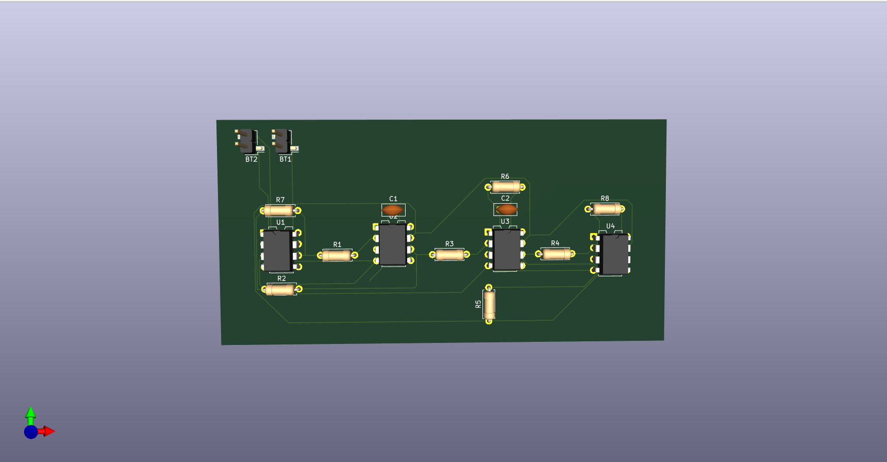
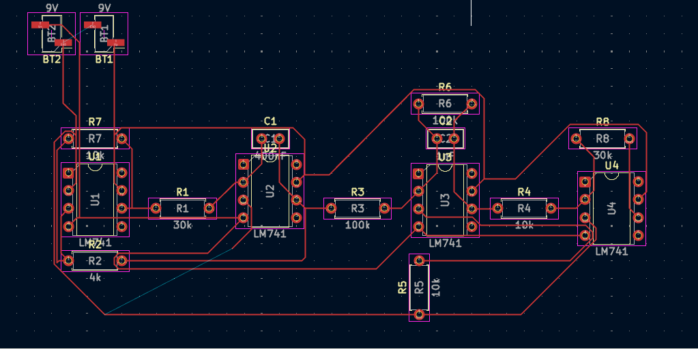
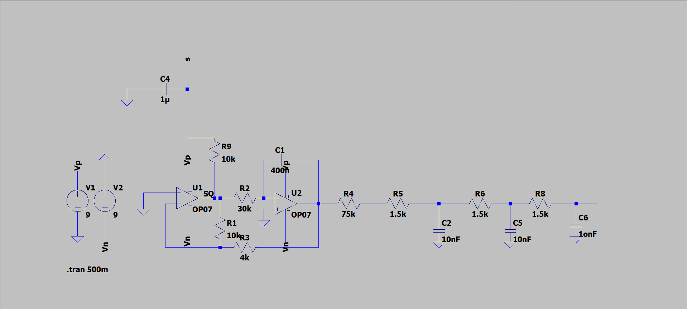
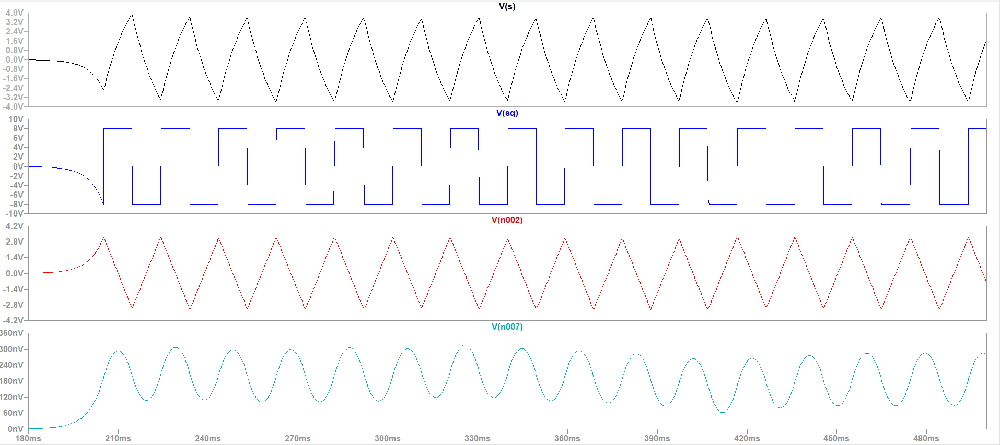
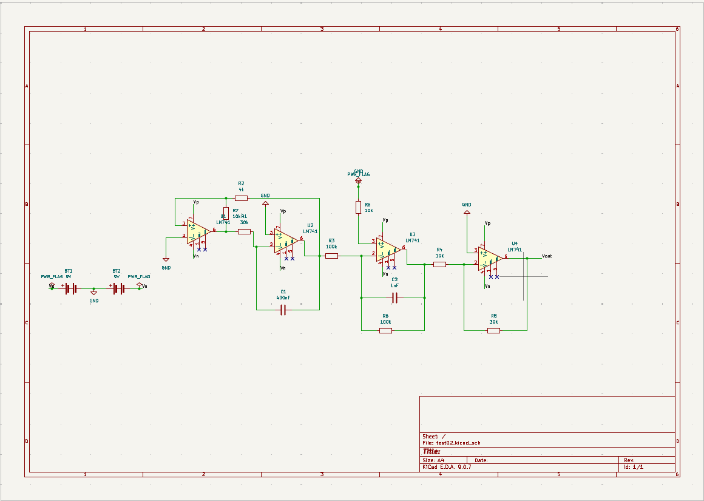

# analog-function-generator-ltspice
Analog function generator capable of generating sine, square, triangle, and sawtooth waveforms using LM741 op-amps designed and simulated in LTspice.
### 3D PCB Design

---

### KiCAD Routing

---

### LTspice Circuit

---

### LTspice Output Waveform

---

### PCB Schematic

